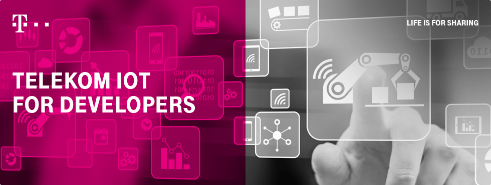

# Deutsche Telekom *Cloud of Things* via MQTT: Arduino library and examples (reference agents)

## The Deutsche Telekom *Cloud of Things*
The *Cloud of Things* (abbr.: "**CoT**") is an IoT (Internet of Things) platform for monitoring, managing and controlling devices hosted by Deutsche Telekom in Germany. It can collect sensor data from decentralized, connected devices and machines, process, analyze and present data, and trigger actions based on the generated insight. 

You can get more information at https://iot.telekom.com/en/platforms/cloud-of-things/.  
:exclamation: Note that you can't use the CoT *free demo account* for this library, because in that accound *MQTT(SN)* isn't available yet.

## About this library
In the above link among other things you find  documentaion about the technical interaction with the CoT (API and protocols); so you can  implement it by yourself. However this task is boilerplate coding.

In this repository you will find an Arduino library and some examples (or *agents*) as sketches to help you to get connected to the CoT with minimal effort.
The source is under MIT licence an thus can be used in your projects in therms of it.

 This library provides flexible and extensible support for
* various Arduino based embedded platforms, explicitely: *ESP8266* and *Tuino0 96* (see below)
* various network devices: WiFi, NB-IoT, GSM 2G
* various protocols to access the CoT: MQTT, MQTT-SN

:de: For now this library is only usable in the network service area of *Deutsche Telekom D1* - this is... **german area**.

:hourglass_flowing_sand: Note that the **NB-IoT** Network - which can be utilized by this library - is currently going to be installed in the german area. So it may not be available at your location for now.

## License
This software is under [*The MIT License (MIT)*](LICENSE).

## Tutorials
* if you got the *Tuino 096* board then you can follow the [Tuino 096 Tutorial](examples/tutorial_tuino096/README.md) for a step by step guidance.

## The Library
Have a deeper look into the structure and the use of the [CoT Arduino Library](src/).

## Details and further reading

### Arduino Setup
The Arduino IDE needs additional setup and configuration steps to be ready for 
this Library. [See the setup guide for step-by-step instructions.](./arduino_setup.md)

### Preparation
* so you got your CoT account and did the installation of this library 
* if you are the first (or only) user of your CoT tenant, you have to prepare it a little bit according to the [SmartREST Cloud Setup Guide](./src/cot_sdk/resources/README.md).

### More Examples
* The easiest way is to use one of the direcly supported boards, as we already have adopted the library to them.
* There are [more examples](examples/README.md) with all kinds of devices and with more use-cases.

### The CoT API
The Device's API of the *Cloud of Things* is identical to the system from [Cumulocity](https://www.cumulocity.com).
For more information about the functionality see their documentation:
* [Device management - Übersicht (Deutsch)](https://www.cumulocity.com/guides/benutzerhandbuch/device-management-deutsch/)
* [Device Management - Overview (English)](https://www.cumulocity.com/guides/users-guide/device-management/)

#### SmartREST: a highly customizable IoT API
This API is based on [REST](https://www.cumulocity.com/guides/rest/introduction/).
But as this API is very gossipy - which is a drawback in the IoT world - an additional "preamplifier" is installed at the CoT: the [SmartREST proxy](https://www.cumulocity.com/guides/rest/smartrest/). It provides the full functionality of the REST API but a reduced protocol overhad. This shrinks the communication ballast for IoT devices to a minimum.
See
* [Cumulocity's SmartREST reference](https://www.cumulocity.com/guides/reference/smartrest/) and 
* the CoT's REST Documentation "REST API Guide (English)" under [Help & Service](https://support.ram.m2m.telekom.com/apps/HelpAndService/index_en.html#) for details.

#### Two way communication via MQTT with the CoT
However also the SmartREST Protocol is mono-directional: the communication opening is always triggered by the device towards the server.
A bi-directional transport - like MQTT - solves this; but it has it's own protocol semantic with its *topics* and topic paths.
The CoT brings those two concepts together by
* establishing a *send* and a *reveive topic* for each device
* transmitting the SmartREST messages and the responses via this transport channels.
For more information about this mechanism read the PDF available in your CoT tenant under **[Help & Service](https://support.ram.m2m.telekom.com/apps/HelpAndService/index_en.html#) > MQTT User Guide (English)**
* please note that this mechanism is CoT specific and thus is different to the [MQTT concept of Cumulocity](https://www.cumulocity.com/guides/mqtt/introduction/)

### Other Hardware: a compatibly list and the *Deutsche Telekom IoT Starter Kit*
A compatibly list of devices is available in the [CoT tenants help](https://support.ram.m2m.telekom.com/apps/HelpAndService/index_en.html#) > 'Improvement of the existing security standards'

## Authors

A list of contibutors can be found in the [AUTHORS file](AUTHORS)
