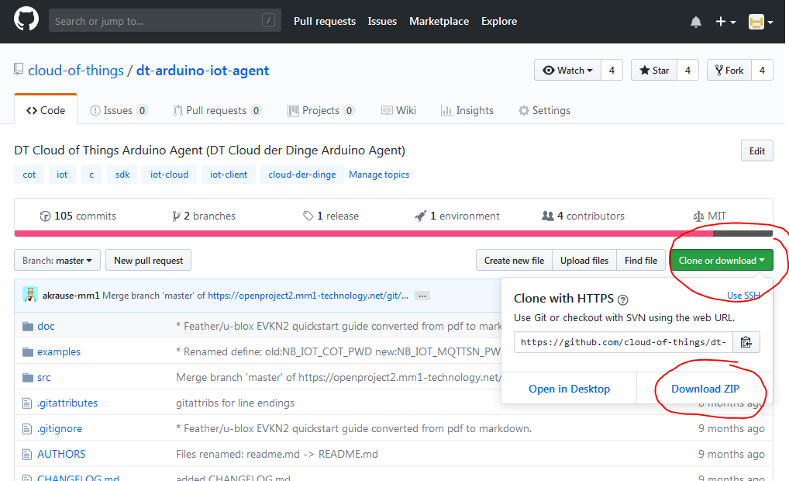

# Setting up the Arduino IDE

## Prerequisites
* this Library and this howto is tested with an Arduino IDE minimal *version* **1.8.6**.

## Installation
### From the Arduino Library Manager
* Download this repository as ZIP:
  * on the GitHub Page click on the green *\[Clone or download\]* button at the upper right
  * *\[Download ZIP\]* to save the file `dt-arduino-iot-agent-master.zip` locally  
.


* in Menu  `Sketch` -> `Include Library` -> `Add .ZIP Library...`
* choose the previously downloaded .ZIP and `Open` it

## Arduino Basic Setup
To be able to compile the Cloud of Things library and the related examples 
the following modifications have to be done respectively components have be added to the Arduino IDE.

### Additional Boards Manager URLs
* in Menu  `File` -> `Preferences`
* find the option "Additional Boards Manager URL" and add the following in the related text box:

`https://raw.githubusercontent.com/gimasi/TUINO_ONE/master/arduino_ide/package_tuino_index.json,https://adafruit.github.io/arduino-board-index/package_adafruit_index.json,http://arduino.esp8266.com/stable/package_esp8266com_index.json,https://raw.githubusercontent.com/gimasi/TUINO_ZERO_96/master/arduino_ide/package_tuino0_index.json`  
(There must not be any blanks inside.)

### Add the Board
* in the Menu `Tools` -> `Board` -> `Boards Manager...`
* depending on the boards you use, you need to install the appropriate *board support libraries*:

 Board | Support library
 ------------ | ------------
 Gimasi Tuino 096  |  `Tuino SAMD Boards (32-bits ARM Cortex-M0+)`
 ESP8266  | `esp8266`
 Tuino1 | `Tuino AVR Boards`

* **on MS Windows**
  * in the lower black Panel of the IDE a litte message will appear:   
```Warning: non trusted contribution, skipping script execution (C:\Users\<you>\AppData\Local\Arduino15\packages\tuino0\hardware\samd\1.0.4\post_install.bat)```
(or the like)
  * open the file explorer (windows explorer) and navigate to that directory 
  * go deeper into `drivers` directory
  * if you have a *Windows 64bit* system (most likely) execute `dpinst-amd64.exe`
  * if you have a *Windows 32bit* system execute `dpinst-x86.exe`
  * you will be asked for administration rights, which you have to commit
  * and give it your trust
* (the device doesn't need to be pluged in your PC for now)
* Check the result: your new board should be listed in the OS's *Device Manager* and shouldn't be marked with issues.
### Libraries
The examples need some libraries been installed.

Please see the [examples pages](examples/README.md) where the respective libraries are listed.  
These are listed in the header section of each of the example sketches.  
