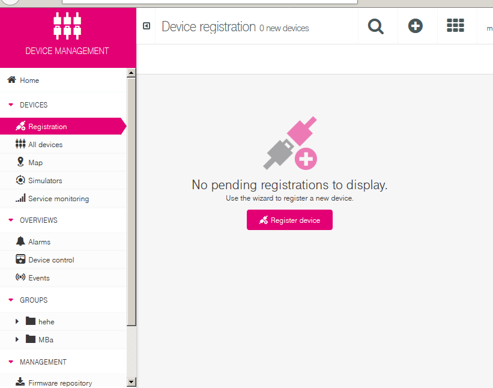

# Device and Cloud - for GSM/LTE-Cat1 Connectivity

## Description
This page describes the "organizational aspects" of the cooperation between devices and cloud.  

### Applicability
:exclamation:
This process is **only** applicable for connections over **GSM/LTE** and the protocolls 
MQTT or HTTP.

:exclamation:
Explicitely it is **not** applicable for **NB-IoT** uplink and the MQTT-SN way.  
The NB-IoT way is completely different; see one of the appropriate sketches for details.


## Adopt your Sketch
The provided example sketches use some default values for CoT server parameters and identity
elements. In addition some values are only placeholders and *have to be set* by you 
specifically. These include
* your local Wifi parameters - if Wifi connection is used
* your CoT tenant Credentials
* your NB-IoT SIM card's CoT password

You have to patch the sketches and give your specific values,  
but this will be described here in detail in the relevant moment.


## Device Registration
### Prerequisites
* The board is connected
* the *serial monitor* logging is available

### ... and: action!

* In `Tools`->`Boards` choose *Tuino 096*
* In `Tools`->`Port` choose the COM Port that should be assigned to your board after driver installation
* Open the *Serial Monitor* (alias *Console* alias *Terminal*) by `Tools`->`Serial Monitor`, set the *speed* to `115200` and place the window beneath
* program the board with `Sketch`->`Upload`
* If an error occurrs (saying that it can't find the board) press the board's *Reset Button* right before clicking *Upload* again
* **Result**
  * in the *Serial Monitor* the line `avrdude done.  Thank you.` should be printed finally
  * the yello LED aside of the antenna plug names `STAT` should blink
  * in the *Serial Monitor* some text should be printed continuous
* give your device a **Name**: 
  * set it in the line `const char* DEVICE_NAME = "<my_DEVICE_NAME>";`
  * :zap: its important that name is **globaly unique**!  
    As advice you can prefix your name with your tenant, e.g. `myTenant.testDevice_1`
* upload the sketch and also open the *Serial Monitor*.  
After some lines a block like this should be printed:   
```
 #################################################################
 ##
 ##       Please register device now in the cloud
 ##       (or save valid credentials for it, if registered)
 ##
 ##       <your device's name>
 ##
 ##       and push button to acknowledge.
 ##
 ##       Then please be patient and wait (about 1 min).
 ##
 #################################################################
```
* in your *tenant* register your board:
  * under *\[Device Management\] > \[Register Device\]* (respectively *\[Registration\]*)  
.
  
.
  * first _Register device_, do a _General device registration_ and give it the _Device ID_ 
    which is your *Device Name* from the devices *Serial Monitor*. Ignore the *group* for now.
 * a new entry should raise with the status _Waiting_, but it should change to _Accept_ 
   after some seconds. 
 * Confirm by pressing \[Accept\].
* in the consol of your hardware the CoT's credentials get printed out:   
```
 ######################################################
 ##
 ##       Device is registered in the cloud.
 ##       Credentials:
 ##         moId     <moId>
 ##         name     <name>
 ##         password <password>
 ##
 ##       Attention!
 ##
 ##       Credentials will not be displayed again!
 ##       Please note carefully!
 ##
 ######################################################
```
 * At the end in your CoT portal there should appear a new entity in *\[Device Management\] > \[All Devices\]*. 
 * A click on the entry should show the details of your new device, the posted measurements, operations and alarms. Note the URL; it is your **Device's CoT Page**.

 * The device has to *permanentely* store these credentials and from that moment on shall commit them at every connection request to the CoT to authenticate and authorize itself against the cloud.
 * the library stores the credentials automatically.  
However - depending on your board's type - this storage may not "survive" a re-programming.

See the below chapter about *sketch development* how to handle this.

At the end in your CoT portal there  should appear a new entity in *Device Management > All Devices*. 
A click on it should show the details of your new device, the posted measurements, operations and alarms.

## Device deletion
You can delete a device (representation) in the cloud. But you have to delete two elements: the device and 
it's "user" aka "credentials" aka "Gerätezugang". 

The *device* is deleted in the list of devices (*All devices* in the *device management* menu) by moving
the mouse to the far right of the element in the list; a *delete* button will appear; click it.

The *device credentials* is deleted in the *Device credentials* menue and choosing the context menue of the
device also at the far rigth (this is that 3-dot button :grey_exclamation:) and klick *Delete*.

## Handing of the *device credentials* during firmware/sketch development
From the sketch (or firmware) pooint of view only the device'
* registration
* deletion
* credentials management (for the password)

mechanisms are relevant and this library performs the necessary steps:
* it implements a persistant data store (EEPROM or Flash) to hold the  device's cloud credentials
* it checks, if the devices already has credentials persisted; if not, it asumes, that there 
* was no registration done yet and...
* on first connection it knocks on the CoT's door.  
The CoT needs a confirmation, that the devices is granted to access the cloud. This is done 
by giving the devices hw Id to a *registration requested* dialog. This steps are described in 
chapter [Device Registration](#Device-Registration).

### Manual crendentials management
However - depending on your board's type - if you work on your sketch and upload 
a new version to the device - the stored credentials *may* get overwritten and thus erased. 

It is not true for a *ESP*, as you can choose to only erase the sketch.  
You can choose this in the Arduino IDE at *Tools > Erase Flash*.

But it is especially true for the *Tuino096*.  
So how to handle this?  
You now either 
* delete the device representation in the cloud. See above how to do this.
* restart the registration process and create a new device in the cloud
  * this dumps the cloud and you have to "clean" it up by deleting the orphant devices there
  * and/or give your device another name to not get collisions with already existing devices.  
  This is done by modifying the automatically created name with 
`CoTConfigDevice...::setDevicePrefix(...)` or `CoTConfigDevice...::setDeviceId(...)`.
* modify your sketch in the way that is has included your device's individual credentials
  * after the registration process the credentials get displayed in the console; see above. 
  * write dem down
  * in the sketch first set the *device name* by `CoTConfigDevice...::setDeviceId("<device_name>")`
  * and also - after creating the CoTSdk - set the credentials 
  by `CotSdkMqtt::setCotCredentials("<device_name>", "<password>", "moId");`  
  so the `setup()` will include a code block like this  
  ```/* Setup the Cloud access and the device to communicate to cloud */
    CoTConfigDeviceTuino096 *boardConfig = new CoTConfigDeviceTuino096();
    boardConfig->setDeviceId("Dev_A1_2550120884");
    CoTDeviceTuino096 *board = new CoTDeviceTuino096(*boardConfig);
    CotSdkMqtt *cotSDK = new CotSdkMqtt(*board);
    cotSDK->setCotCredentials("Dev_A1_2550120884", "juHUU", "544022");
  ```
 