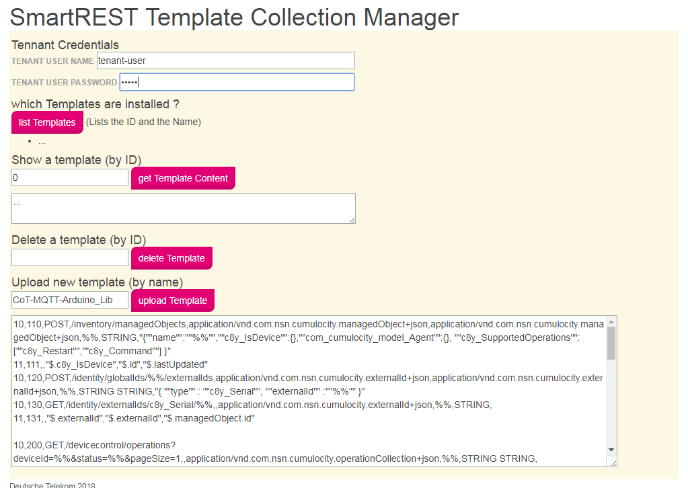

# SmartREST for the Lib and the Examples

## SmartREST Template Collection
The arduino cot library will not work until the CoT is prepared with a special artifact: a *SmartREST Template Collection*. A client implementation needs to be implemented against a specific collection.

The collection that matches this library - and the examples - is stored in this repo as [smartrest_templates.csv](./smartrest_templates.csv).

## Upload a template collection
The "hard" but official way is described in the documentation  in your CoT tenant:
read the PDF available in your tenant under **Help & Service > REST API Guide (English)** in chapter *5.4. How are templates registered?*

### The *Template Collection Manager*
To speed this step up we built an "easy access":
it is a so called *Web App* for the CoT which provides a simple UI to do this.

In your CoT tenant go to **Administration > Applications** and check, if an entry *Cotarduionosdkhelper* is already listed. If not...
klick **Add  application**, choose *Upload ZIP file* and point to [https://github.com/tsi5/cot_arduino_sdk_helper_app/releases/download/v1.0/cotarduionosdkhelper.zip](https://github.com/tsi5/cot_arduino_sdk_helper_app/releases/download/v1.0/cotarduionosdkhelper.zip) (you may need to download it loacally first).

After that you should have a new application *Cotarduionosdkhelper* available in you apps menu. 
(If no page is displayed after opening, choose *Template manager* in the left menu bar.)

(Also you may need to clear you browser cache, if there was an old version of the plugin installed before.)

You finally should get the *SmartREST Template Collection Manager* displayed.
Follow the instructions there and...

upload the content of the above template collection file ([smartrest_templates.csv](./smartrest_templates.csv)) - that is, copy and past the text into the input field below - and give it the name **`CoT-MQTT-Arduino_Lib`**.

